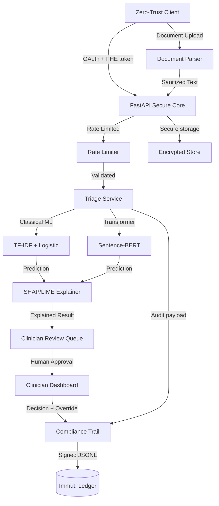

# 𝘊𝘢𝘳𝘦𝘚𝘦𝘯𝘴𝘦 𝘟


[](https://www.python.org)
[](https://fastapi.tiangolo.com)
[](https://github.com/ibarrond/Pyfhel)
[](https://github.com/IBM/diffprivlib)
[](LICENSE)
[](https://nessakodo.com)

---

## 𝘜𝘱𝘥𝘢𝘵𝘦𝘴 (𝘷0.3.0)

CareSense X evolves into a **full-scale production-grade decision intelligence platform**:

### 🧠 **Explainable AI**
- **SHAP** and **LIME** explainability modules with security hardening
- Per-prediction feature importance + global model insights
- Transparent decision reasoning for clinician trust

### 📄 **Multi-Format Document Processing**
- Secure **PDF**, **DOCX**, **TXT**, and **email** parsing
- Content sanitization + PII detection
- File size validation + MIME type enforcement
- Hash-based audit trails

### 🤖 **Hybrid ML Architecture**
- **Classical**: Calibrated logistic regression (TF-IDF + SVD)
- **Modern**: Sentence-transformers for semantic embeddings
- **Flexible**: Switch models based on use case

### 🏥 **Clinician Review Workflow**
- Human-in-the-loop dashboard with priority queuing
- Approval, rejection, and escalation workflows
- Override capabilities with audit logging
- Real-time case synchronization

### 🔒 **Production Security**
- **Rate limiting**: Token bucket algorithm per IP + endpoint
- **Security headers**: CSP, HSTS, X-Frame-Options, etc.
- **Input validation**: Comprehensive sanitization across all endpoints
- **Audit trails**: Every action signed with Ed25519

---

## 𝘔𝘪𝘴𝘴𝘪𝘰𝘯

Healthcare teams need **privacy-preserving automation** that still learns from patient data while maintaining human oversight. CareSense X delivers explainable triage intelligence, biometric authentication, document processing, and zero-trust workflow orchestration without exposing PHI—aligning with HIPAA, GDPR, and emerging FDA CDS guidance.

---

## 𝘚𝘰𝘭𝘶𝘵𝘪𝘰𝘯

- **Privacy-preserving biometric attestation** powered by CKKS homomorphic encryption via Pyfhel
- **Explainable predictions** with SHAP/LIME showing top features driving each decision
- **Multi-format document ingestion** (PDF, DOCX, email) with secure parsing and PII detection
- **Hybrid ML pipeline**: classical + transformer models for accuracy and interpretability
- **Clinician review dashboard**: human-in-the-loop workflow with override and audit trail
- **Encrypted symptom processing** with calibrated ML, differential privacy, and structured audit logs
- **Automated care workflows**: compliance-signed triage decisions ready for orchestration (EHR hooks, alerting)
- **Production security**: rate limiting, security headers, input sanitization, audit logging
- **Continuous compliance**: Ed25519-signed JSONL audit trail + security policy for rapid incident response

---

## 𝘌𝘯𝘩𝘢𝘯𝘤𝘦𝘥 𝘈𝘳𝘤𝘩𝘪𝘵𝘦𝘤𝘵𝘶𝘳𝘦



---

## 𝘛𝘦𝘤𝘩 𝘚𝘵𝘢𝘤𝘬

### **Core**
- **Backend**: FastAPI, Uvicorn, Pydantic v2, Structlog, Python 3.11+
- **Frontend**: React 18 + Vite 5, TailwindCSS, React Query 5, Heroicons, zod

### **ML & AI**
- **Classical ML**: Scikit-learn 1.4, Calibrated LogisticRegression, Truncated SVD
- **Transformers**: Sentence-Transformers, HuggingFace Transformers, PyTorch
- **Explainability**: SHAP 0.45+, LIME 0.2+
- **Privacy**: DiffPrivLib (differential privacy ready)

### **Document Processing**
- **Parsers**: PyPDF (PDF), python-docx (DOCX), email-reply-parser
- **Sanitization**: Bleach (HTML), python-magic (MIME detection)
- **OCR**: Pytesseract, Pillow

### **Privacy & Security**
- **Encryption**: Pyfhel (CKKS), Cryptography (Ed25519, Fernet)
- **Authentication**: python-jose (JWT), passlib (bcrypt)
- **Rate Limiting**: slowapi, Redis-ready
- **Security**: Comprehensive input validation, security headers, CORS

### **Tooling & Ops**
- **Development**: Docker, Make, Ruff, Pytest
- **Security Scanning**: pip-audit, Safety
- **Monitoring**: Prometheus metrics, Structlog
- **Performance**: uvloop, orjson

---

## 𝘈𝘗𝘐 𝘙𝘰𝘶𝘵𝘦𝘴

### **Core Triage**
| Method | Path | Purpose |
|:---|:---|:---|
| `GET` | `/version` | Service version + build info |
| `GET` | `/v1/health` | Readiness probe |
| `POST` | `/v1/triage` | Submit symptoms with optional biometric proof |

### **Biometrics**
| Method | Path | Purpose |
|:---|:---|:---|
| `POST` | `/v1/biometrics/enrol` | Encrypt + register biometric embeddings |

### **Explainability** (NEW)
| Method | Path | Purpose |
|:---|:---|:---|
| `POST` | `/v1/explain` | Get SHAP or LIME explanation for prediction |
| `GET` | `/v1/explain/global` | Get global feature importance across model |

### **Document Processing** (NEW)
| Method | Path | Purpose |
|:---|:---|:---|
| `POST` | `/v1/documents/upload` | Upload & parse PDF/DOCX/TXT/email |
| `POST` | `/v1/documents/triage` | Run triage on parsed document text |

### **Clinician Review** (NEW)
| Method | Path | Purpose |
|:---|:---|:---|
| `GET` | `/v1/review/pending` | Get pending review cases with priority filtering |
| `GET` | `/v1/review/{case_id}` | Get full case details including explanation |
| `POST` | `/v1/review/submit` | Submit clinician review decision with override |

### **Compliance**
| Method | Path | Purpose |
|:---|:---|:---|
| `GET` | `/v1/compliance/public-key` | Retrieve Ed25519 public key for audit verification |

All responses include signed audit references for immutable compliance review.

---

## 𝘘𝘶𝘪𝘤𝘬 𝘚𝘵𝘢𝘳𝘵 (𝘓𝘰𝘤𝘢𝘭 𝘙𝘶𝘯)

**Requirements**

- Python ≥ 3.11
- Node.js ≥ 20
- Tesseract OCR binary (for dataset extraction)
- Optional: Docker 26+, Make, UV loop support
- **For macOS**: OpenMP (via Homebrew) for pyfhel compilation

**Setup**

```bash
# Install OpenMP on macOS (required for pyfhel)
brew install libomp

# Install dependencies
make install              # installs runtime + dev dependencies

# Build dataset and train model
python ocr_extract.py     # builds hashed OCR dataset (once)
make train                # trains calibrated DP triage model

# Run backend
make serve                # boots FastAPI with reload on :8080

# Run frontend (separate terminal)
cd frontend && npm run dev  # launches command center on :5173
```

Browse interactive docs at `http://localhost:8080/docs` (Swagger) or `http://localhost:8080/redoc`.

Frontend command center available at `http://localhost:5173`.

**Docker Compose (Recommended)**

```bash
docker compose up --build
# FastAPI → http://localhost:8080
# Frontend → http://localhost:4173
```

---

## 𝘜𝘴𝘢𝘨𝘦 𝘌𝘹𝘢𝘮𝘱𝘭𝘦𝘴

### **1. Basic Triage**

```bash
curl -X POST http://localhost:8080/v1/triage \
  -H "Content-Type: application/json" \
  -d '{
    "symptoms": "severe chest pain, shortness of breath, sweating"
  }'
```

### **2. Explainable Prediction**

```bash
curl -X POST http://localhost:8080/v1/explain \
  -H "Content-Type: application/json" \
  -d '{
    "text": "severe headache, blurred vision, dizziness",
    "method": "shap"
  }'
```

### **3. Document Upload**

```bash
curl -X POST http://localhost:8080/v1/documents/upload \
  -F "file=@patient_report.pdf"
```

### **4. Clinician Review**

```bash
# Get pending cases
curl "http://localhost:8080/v1/review/pending?clinician_id=dr_smith&priority=high"

# Submit review
curl -X POST http://localhost:8080/v1/review/submit \
  -H "Content-Type: application/json" \
  -d '{
    "case_id": "abc123...",
    "clinician_id": "dr_smith",
    "decision": "approved",
    "notes": "Confirmed high urgency, appropriate recommendation"
  }'
```

---

## 𝘊𝘭𝘪𝘦𝘯𝘵 𝘌𝘹𝘱𝘦𝘳𝘪𝘦𝘯𝘤𝘦 (𝘍𝘳𝘰𝘯𝘵𝘦𝘯𝘥)

- **Biometric enrollment wizard** with synthetic demo embeddings
- **Document upload interface** with drag-drop support
- **Encrypted triage submission** with urgency badges and compliance signature cards
- **Explainability visualization** showing top features and importance scores
- **Clinician review dashboard** with priority queuing and real-time updates
- **Live compliance ledger key viewer** for transparent verification
- **React Query cache** with offline-friendly refresh behaviour
- **Tailwind-driven dark holographic UI** tuned for clinical command centers

---

## 𝘚𝘦𝘤𝘶𝘳𝘪𝘵𝘺 𝘍𝘦𝘢𝘵𝘶𝘳𝘦𝘴

### **Defense in Depth**
1. **Input Validation**: Length limits, type checking, pattern validation
2. **Sanitization**: HTML stripping, XSS prevention, SQL injection protection
3. **Rate Limiting**: 60 req/min per IP with burst tolerance
4. **Security Headers**: CSP, HSTS, X-Frame-Options, X-Content-Type-Options
5. **Audit Logging**: Ed25519-signed immutable trails for all actions

### **Privacy Controls**
- **No PHI storage**: Only hashes and encrypted data
- **PII detection**: Automatic flagging of sensitive data in documents
- **Homomorphic encryption**: Biometric comparisons without decryption
- **Differential privacy**: Model training with privacy guarantees

### **Compliance**
- **HIPAA-aligned**: Encrypted storage, audit trails, access controls
- **GDPR-ready**: Data minimization, right to erasure support
- **FDA CDS guidance**: Human oversight, explainability, audit trails

---

## 𝘈𝘶𝘥𝘪𝘵 & 𝘊𝘰𝘮𝘱𝘭𝘪𝘢𝘯𝘤𝘦

- `data/audit_logs.jsonl`: append-only ledger signed via Ed25519
- `data/crypto/`: CKKS context + secret keys (auto-generated, keep out of VCS)
- `SecureStore`: Fernet-encrypted biometric payloads on disk
- `Makefile security-scan`: pip-audit + Safety to flag vulnerable dependencies
- `docs/openapi.yaml`: machine-readable spec for downstream SDK generation
- `docs/architecture.md`: living diagram + hardening checklist for reviews
- **Review queue**: JSONL-based clinician decision audit trail

---

## 𝘔𝘓 𝘖𝘱𝘴 & 𝘗𝘦𝘳𝘧𝘰𝘳𝘮𝘢𝘯𝘤𝘦

- **Classical Model**: Balanced, calibrated logistic regression with class-weighting and isotonic calibration
- **Transformer Model**: Sentence-BERT embeddings + lightweight classifier for semantic understanding
- **Explainability**: SHAP kernel explainer + LIME text explainer for transparent decisions
- `reports/model_card.md`: continuously regenerated model card + micro-F1 metrics
- `reports/model_report.json`: raw classification report for dashboards
- **Differential privacy ready**: plug in DP noise budgets via DiffPrivLib wrappers
- **Frontend overlays**: display metrics and compliance handles for human-in-the-loop review

---

## 𝘙𝘰𝘢𝘥𝘮𝘢𝘱 (𝘷0.4+)

- **Advanced ML**: Fine-tuned medical BERT models with domain adaptation
- **Multi-modal**: Image + text analysis for comprehensive medical assessment
- **Zero-knowledge proofs**: Enhanced biometric attestation
- **Secure enclave deployment**: AWS Nitro Enclaves / Azure SEV-SNP profiles
- **FHIR R5 bridge**: EHR integration with consent-aware data minimization
- **Real-time alerts**: Clinician notification webhooks (Slack, Teams, PagerDuty)
- **Generative explanations**: Guardrailed LLM explanations with PHI redaction
- **Mobile apps**: iOS/Android clinician review clients
- **Advanced analytics**: Outcome tracking, model performance monitoring, bias detection

---

## 𝘋𝘦𝘷𝘦𝘭𝘰𝘱𝘮𝘦𝘯𝘵 & 𝘛𝘦𝘴𝘵𝘪𝘯𝘨

```bash
# Run tests
make test

# Lint code
make lint

# Format code
make format

# Security scan
make security-scan

# Generate OpenAPI spec
make openapi
```

---

## 𝘊𝘳𝘦𝘥𝘪𝘵𝘴 & 𝘚𝘶𝘱𝘱𝘰𝘳𝘵

Built with care by [Nessa Kodo](https://nessakodo.com). Licensed under the MIT License. For enterprise pilots or security reviews, reach out at `security@caresense.app`.

**Contributing**: See [CONTRIBUTING.md](CONTRIBUTING.md) for guidelines.

**Security**: See [SECURITY.md](SECURITY.md) for vulnerability reporting.

Stay vigilant. Stay encrypted. Stay explainable.

---
