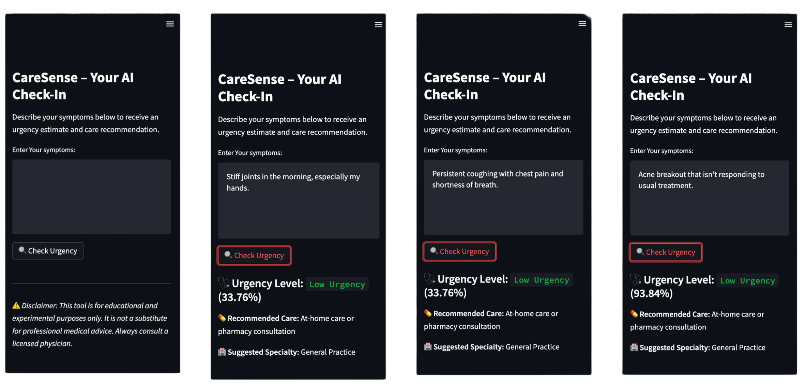

# CareSense

[](https://www.python.org)  [](https://scikit-learn.org)  [](https://streamlit.io)  [](https://github.com/tesseract-ocr/tesseract)  [](LICENSE)  [](https://nessakodo.com)

---


> Deployed at: [caresense.streamlit.app](https://caresense.streamlit.app) *(Demo instance)*

---

## Recognition 
CareSense was awarded 3rd Place at AurariaHack 2025 among over 40 teams for its accessible design, social impact, and meaningful approach to AI in healthcare. The judges recognized its potential for real-world triage assistance, especially in under-resourced contexts.

--- 

## Future Enhancements
While CareSense currently provides secure, local-only triage, future iterations are focused on privacy-first healthcare logging and integration. Our roadmap includes:

### HealthKit Integration (Apple Devices)
Allow users to securely forward symptom logs to Apple Health without storing any data on external servers. This enables:

- Seamless aggregation with Oura Ring, Apple Watch, and other biometrics
- Symptom-based radar models aligned with circadian data, vitals, and stress markers
- Automatic timestamping and encrypted log forwarding

### Emotion-Aware NLP
- Implement emotion tagging to separate psychological states from physical symptoms. For example:
"I feel anxious" would not affect triage urgency
*But it would trigger a CareSense Insight about stress-related care options (e.g. mental health referral, mindfulness support, etc.)*

This allows the tool to empathize intelligently—not escalate unnecessarily, but still surface holistic care guidance.

### Visual Timeline & Triage Graph
- Logged symptoms will be visualized over time with urgency gradients, helping users see how their health evolves—and when it’s time to act.

---

## Project Overview

CareSense is an AI-powered symptom triage assistant that helps users determine the urgency of their symptoms before visiting a healthcare provider. By using real patient data and natural language processing, it offers immediate feedback, care guidance, and specialist recommendations.

---

## Problem

Many people delay care or misuse emergency services due to confusion or lack of access to accurate medical triage. This can lead to worsened conditions, overcrowded ERs, and lost time for both patients and providers.

---

## Solution

CareSense classifies free-text symptom descriptions into urgency levels—low, medium, or high—and provides actionable insights based on symptom context and frequency.

---

## Features

- Accepts natural language symptom descriptions  
- Returns urgency level with confidence scores  
- Suggests care guidance and medical specialty  
- Tracks previously entered symptoms and flags recurring issues  
- Optional OCR mode for extracting symptoms from image-based reports

---

## How to Run Locally

1. **Install dependencies**

```bash
pip install -r requirements.txt
```

2. **Extract data (optional if already extracted)**

```bash
python ocr_extract.py
```

3. **Train the model**

```bash
python train_model.py
```

4. **Run the app**

```bash
python -m streamlit run app.py
```

---

## Windows-Specific Setup Notes

If using OCR (image-based input):

- Install [Tesseract for Windows](https://github.com/tesseract-ocr/tesseract)  
- Add the path to `tesseract.exe` to your system `PATH` (e.g. `C:\Program Files\Tesseract-OCR\tesseract.exe`)
- Confirm installation:

```bash
tesseract --version
```

---

## Demo

*CareSense evaluates natural language symptom descriptions and assigns an urgency level, recommended care, and medical specialty. Below are examples of inputs and their corresponding urgency assessments:*

### Test Prompts

### Low Urgency
Input:
"My sinuses feel stuffy, and my eyes have been quite red. I simply lack energy, and my throat has been really scratchy. Along with the swelling in my lymph nodes, I've also been coughing up a lot of phlegm."

Result:

Urgency Level: Low

Care Recommendation: At-home care or pharmacy consultation

Suggested Specialty: General Practice
CareSense interpreted this as a common cold or mild respiratory infection, manageable with rest and over-the-counter medication.

### Medium Urgency
Input:
"My muscles have been feeling really weak, and my neck has been extremely tight. I've been experiencing a lot of stiffness when I walk about and my joints have been swollen. Walking has also been really uncomfortable."

Result:

Urgency Level: Medium

Care Recommendation: Schedule with a primary care provider

Suggested Specialty: Internal Medicine or Rheumatology
CareSense flagged this as potentially indicative of an inflammatory or musculoskeletal condition requiring non-emergency follow-up.

### High Urgency
Input:
"I'm having a hard time breathing and I feel really uncomfortable. I'm sweating a lot, my chest hurts and my heart is beating fast. The mucus I'm coughing up is brownish."

Result:

Urgency Level: High

Care Recommendation: Seek immediate medical attention

Suggested Specialty: Emergency Medicine
This description matches symptoms of acute respiratory distress or infection, and CareSense escalates the case for urgent care.





---

## Credits

Created and maintained by [Nessa Kodo](https://nessakodo.com) built during AurariaHack 2025 at CU Denver.

---
