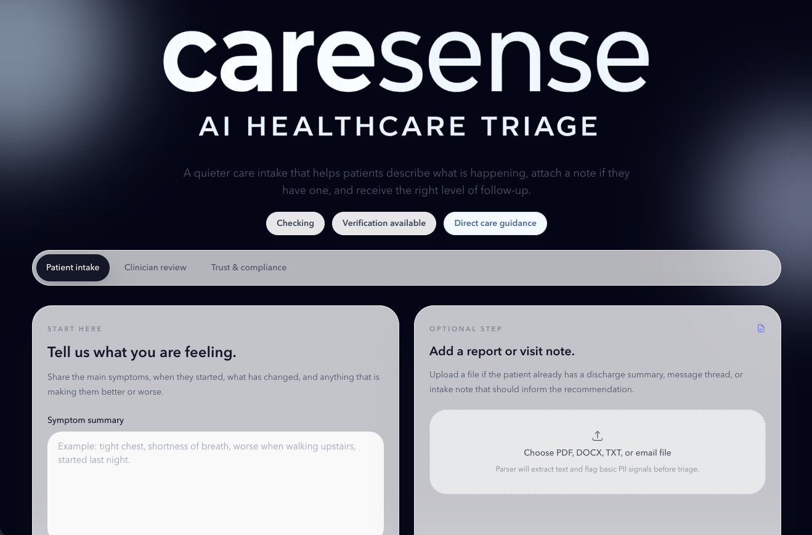
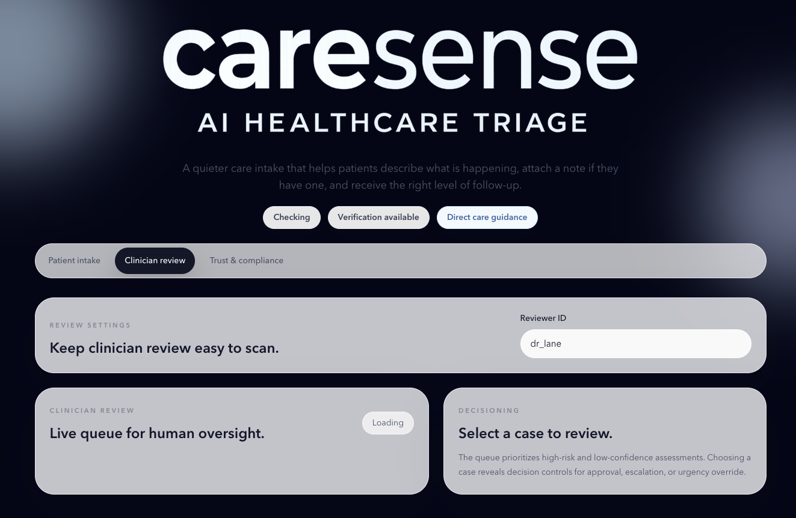
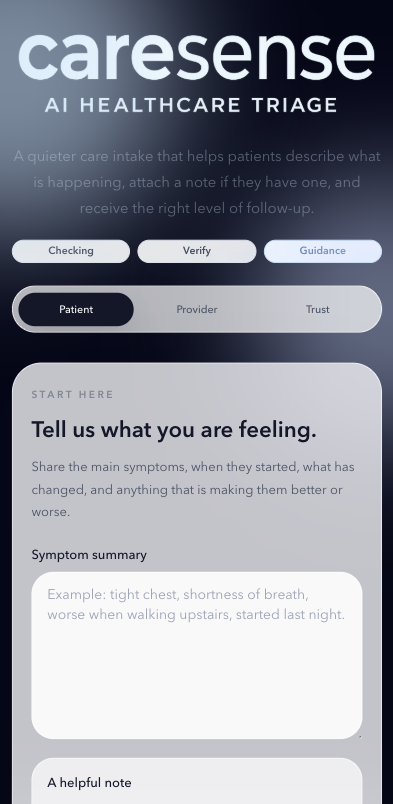
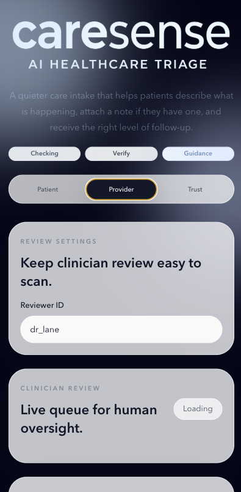
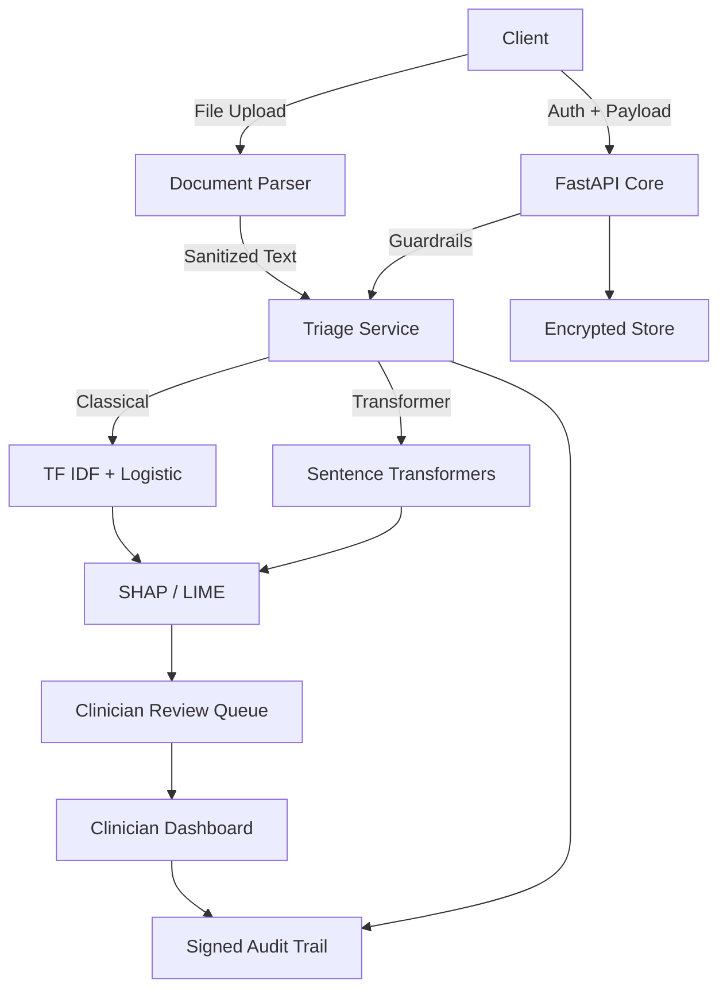

# 𝘊𝘢𝘳𝘦𝘚𝘦𝘯𝘴𝘦


[](https://www.python.org)
[](https://fastapi.tiangolo.com)
[](https://github.com/ibarrond/Pyfhel)
[](https://github.com/IBM/diffprivlib)
[](LICENSE)
[](https://vanessamadison.com)

---

## 𝘖𝘷𝘦𝘳𝘷𝘪𝘦𝘸

**CareSense** is a privacy preserving clinical triage and document intelligence platform.

It combines homomorphic encryption, differential privacy, explainable machine learning, and a clinician review dashboard to support safe decision support without exposing raw patient data.

The system is designed as a research grade reference implementation for future compliant decision support tools aligned with HIPAA, GDPR, and emerging FDA clinical decision support guidance.

---

## 𝘒𝘦𝘺 𝘊𝘢𝘱𝘢𝘣𝘪𝘭𝘪𝘵𝘪𝘦𝘴

- **Explainable triage models**  
  SHAP and LIME explanations for each prediction plus global feature importance

- **Multi format document processing**  
  Secure parsing for PDF, DOCX, plain text, and email content with PII detection and sanitization

- **Hybrid ML pipeline**  
  Classical calibrated logistic regression and transformer based embeddings for flexible tradeoffs between speed and accuracy

- **Clinician in the loop review**  
  Review queue with prioritization, override support, and full audit trail of decisions

- **Privacy and security by design**  
  Homomorphic encryption for biometric attestation, differential privacy ready training, rate limiting, security headers, and signed audit logs

---

## 𝘍𝘳𝘰𝘯𝘵𝘦𝘯𝘥 𝘷2

The CareSense frontend has been completely redesigned in v2 to provide a sleek, modern, and highly responsive experience for both patients and healthcare providers. The updated interface focuses on clarity, accessibility, and real-time feedback.

<p align="center">
  
  
  <br />
  <em>Figure 1: Sleek web interfaces for patient triage (left) and provider review dashboard (right).</em>
</p>

<p align="center">
  
  &nbsp;&nbsp;&nbsp;&nbsp;
  
  <br />
  <em>Figure 2: Mobile-optimized views ensuring clinical decision support is accessible on the go.</em>
</p>

---

## 𝘏𝘪𝘨𝘩 𝘓𝘦𝘷𝘦𝘭 𝘈𝘳𝘤𝘩𝘪𝘵𝘦𝘤𝘵𝘶𝘳𝘦


```mermaid
flowchart TB
    Client[Client] -->|Auth + Payload| API[FastAPI Core]
    Client -->|File Upload| Parser[Document Parser]

    Parser -->|Sanitized Text| Triage[Triage Service]
    API -->|Guardrails| Triage

    Triage -->|Classical| Classical[TF IDF + Logistic]
    Triage -->|Transformer| Transformer[Sentence Transformers]

    Classical --> Explain[SHAP / LIME]
    Transformer --> Explain

    Explain --> Review[Clinician Review Queue]
    Review --> Dashboard[Clinician Dashboard]

    Dashboard --> Audit[Signed Audit Trail]
    Triage --> Audit
    API --> Vault[Encrypted Store]
```

Core concepts:

* FastAPI service as secure entrypoint
* Document parsing and sanitization before triage
* Classical and transformer pipelines feeding a shared explanation layer
* Review queue and dashboard for human oversight
* Encrypted storage and signed JSONL audit ledger

---

## 𝘛𝘦𝘤𝘩 𝘚𝘵𝘢𝘤𝘬

**Backend**

* FastAPI, Uvicorn, Pydantic
* Scikit learn, Sentence Transformers, PyTorch
* Pyfhel for CKKS based homomorphic encryption
* DiffPrivLib for differential privacy ready training
* Cryptography library for Ed25519 signatures and symmetric encryption

**Frontend**

* React with Vite
* TailwindCSS
* React Query for data fetching and caching

**Tooling**

* Docker and Make based workflows
* Pytest for tests
* Ruff and formatting tools
* pip audit and Safety for dependency scanning

---

## 𝘘𝘶𝘪𝘤𝘬 𝘚𝘵𝘢𝘳𝘵

### Requirements

* Python 3.11 or newer
* Node.js 20 or newer
* Tesseract binary for OCR based dataset builds
* Optional Docker and Make

### Local setup

```bash
# Optional on macOS for Pyfhel
brew install libomp

# Install Python dependencies
make install

# Build example dataset and train model
python ocr_extract.py
make train

# Run backend
make serve          # FastAPI on :8080

# Run frontend in a separate terminal
cd frontend
npm install
npm run dev         # Frontend on :5173
```

Interactive documentation is available at:

* API docs: `http://localhost:8080/docs`
* Frontend command center: `http://localhost:5173`

### Docker compose

```bash
docker compose up --build
# Backend:  http://localhost:8080
# Frontend: http://localhost:4173
```

---

## 𝘈𝘗𝘐 𝘖𝘷𝘦𝘳𝘷𝘪𝘦𝘸

Core routes are versioned under `/v1`.

**Service and health**

| Method | Path         | Description               |
| :----- | :----------- | :------------------------ |
| GET    | `/version`   | Service version and build |
| GET    | `/v1/health` | Liveness and readiness    |

**Triage and explanation**

| Method | Path                 | Description                         |
| :----- | :------------------- | :---------------------------------- |
| POST   | `/v1/triage`         | Submit symptoms for triage          |
| POST   | `/v1/explain`        | Explanation for a single prediction |
| GET    | `/v1/explain/global` | Global feature importance summary   |

**Documents and review**

| Method | Path                   | Description                         |
| :----- | :--------------------- | :---------------------------------- |
| POST   | `/v1/documents/upload` | Upload and parse clinical document  |
| POST   | `/v1/documents/triage` | Run triage on parsed document text  |
| GET    | `/v1/review/pending`   | Pending cases in review queue       |
| GET    | `/v1/review/{case_id}` | Full details for a single case      |
| POST   | `/v1/review/submit`    | Submit clinician decision and notes |

**Compliance**

| Method | Path                        | Description                             |
| :----- | :-------------------------- | :-------------------------------------- |
| GET    | `/v1/compliance/public-key` | Ed25519 public key for audit validation |

All responses include references into the signed audit ledger for traceability.

---

## 𝘚𝘦𝘤𝘶𝘳𝘪𝘵𝘺 𝘢𝘯𝘥 𝘊𝘰𝘮𝘱𝘭𝘪𝘢𝘯𝘤𝘦

**Security controls**

* Input validation and sanitization on all routes
* Rate limiting at the API layer
* Standard security headers and CORS configuration
* Ed25519 signed append only audit logs
* Encrypted at rest storage for sensitive payloads

**Privacy and regulatory posture**

* Data minimization and PII detection for uploaded documents
* Homomorphic encryption for biometric like signals to avoid raw storage
* Differential privacy ready training pipeline
* Design aligned with HIPAA and GDPR principles, with human oversight baked into the workflow

CareSense is a research and prototype platform and is not intended for direct production use with real patient data without additional hardening and formal review.

---

## 𝘙𝘰𝘢𝘥𝘮𝘢𝘱

Planned directions for future versions include:

* Domain specific transformer models for clinical text
* FHIR based integration for read and write flows
* Secure enclave deployment profiles
* Expanded analytics for outcome tracking and bias monitoring
* Mobile first interfaces for clinician review

---

## 𝘓𝘪𝘤𝘦𝘯𝘴𝘦 𝘢𝘯𝘥 𝘊𝘰𝘯𝘵𝘢𝘤𝘵

CareSense is released under the MIT License. See the [LICENSE](LICENSE) file for details.

**Author**: Vanessa Madison
**Site**: [vanessamadison.com](https://vanessamadison.com)

For research collaboration or security review discussions, open an issue or reach out through the contact details on the site.


